# User Guide — Jireh Internal Dashboard

A quick tour of the dashboard: tracking assets, managing tasks, and
administering users and roles.

---

## 1. Logging In

Anonymous visitors can browse the site, but creating or editing records
requires logging in as an **admin** (or superuser).

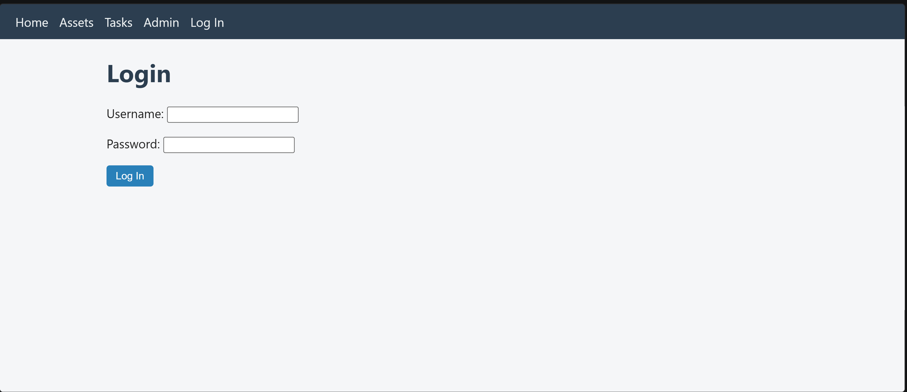

Enter your username and password and click **Log In**. Once logged in, your
username appears in the top navigation bar along with a **Log Out** button.

---

## 2. Dashboard Home

After logging in, the home page gives an at-a-glance summary of the system:
total assets, and tasks broken down by status (Open, In Progress, Done).

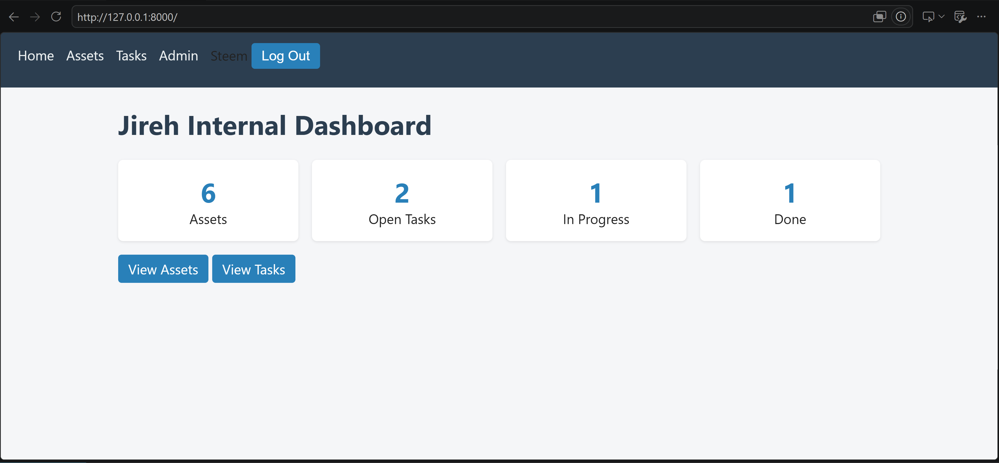

From here you can jump straight to **View Assets** or **View Tasks**.

---

## 3. Assets

### Asset List

The **Assets** page lists every piece of equipment being tracked, along with
its current status and location.

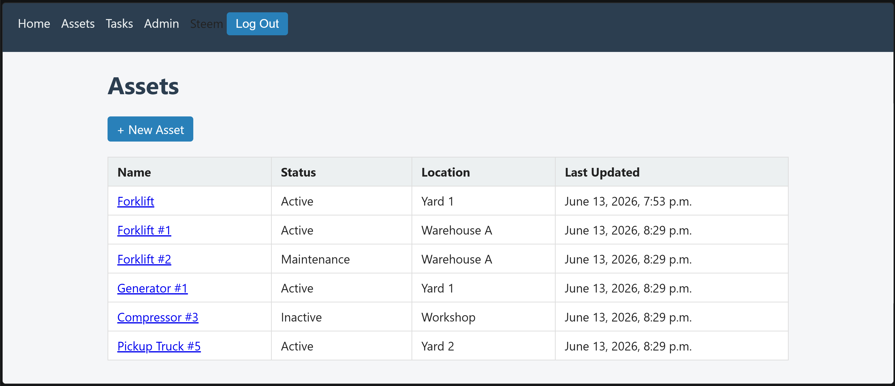

- Click any asset name to view its full details.
- Admins see a **+ New Asset** button to add new equipment.

### Asset Detail

Clicking into an asset shows its full record, including notes and timestamps.

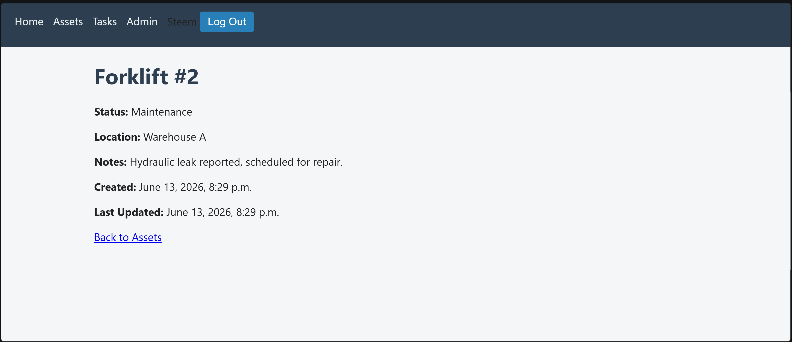

### Adding a New Asset

Click **+ New Asset** from the Assets list to open the creation form. Fill in
the name, status (Active / Inactive / Maintenance), location, and any notes,
then click **Save**.

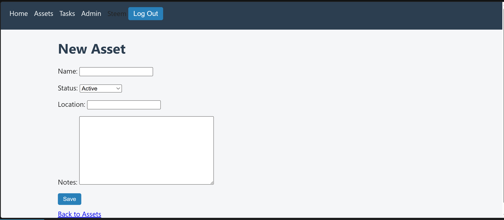

### Updating an Asset

Asset records can be edited from the Django admin panel. Open **Admin** in the
nav bar, go to **Dashboard → Assets**, and select the asset to edit its
fields or delete it.

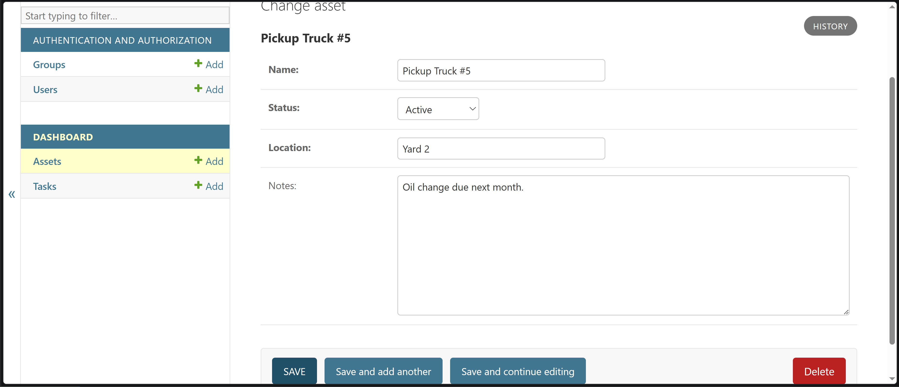

---

## 4. Tasks

### Task List

The **Tasks** page lists all tracked tasks/change requests, with status,
who created them, and when. Use the dropdown to filter by status (Open, In
Progress, Done).

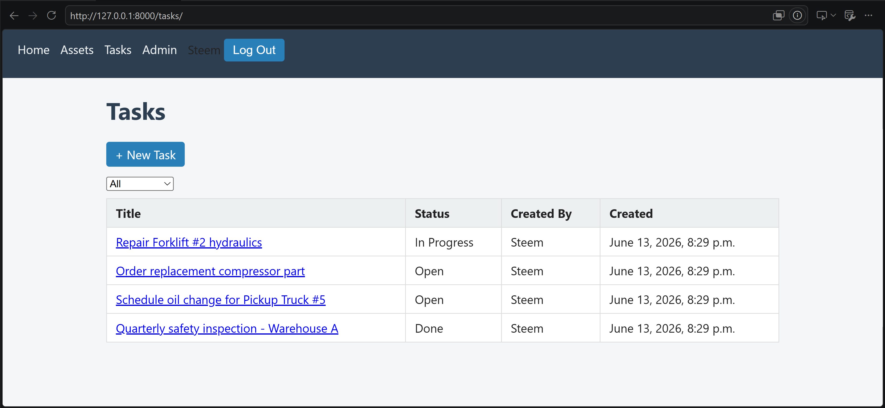

### Task Detail

Clicking a task title shows its full description, status, creator, and
timestamps.

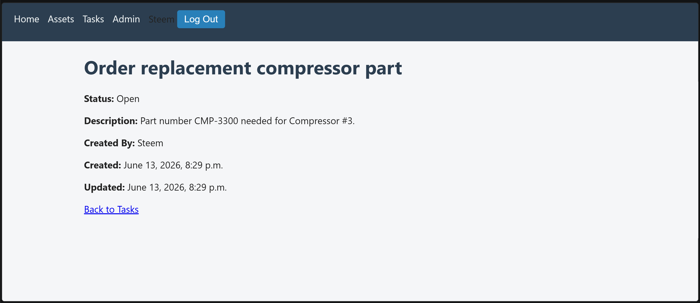

### Adding a New Task

Click **+ New Task** from the Tasks list. Enter a title, description, and
initial status, then click **Save**. The task is automatically attributed to
the logged-in user.

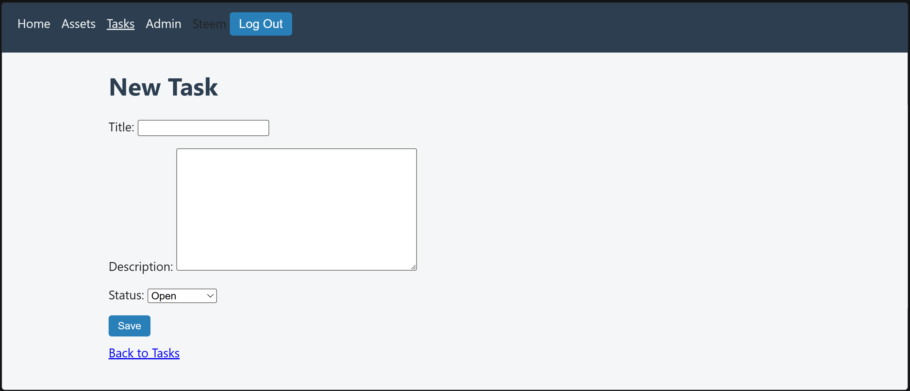

### Updating a Task

Like assets, tasks can be edited (status changes, reassigning the creator,
etc.) from the Django admin panel under **Dashboard → Tasks**.

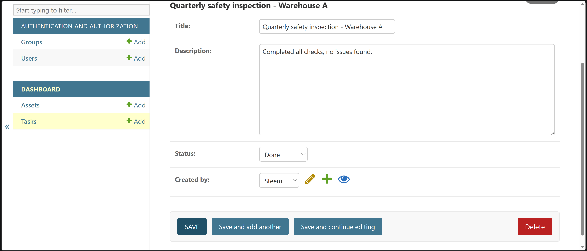

---

## 5. Admin Panel — Managing Users and Roles

The Django admin panel (`/admin/`) is where superusers manage accounts, roles,
and raw data.

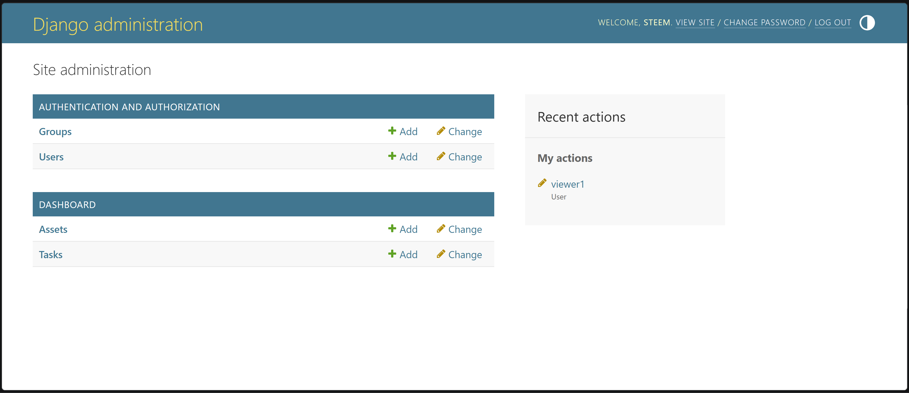

### Managing Users

Go to **Authentication and Authorization → Users** to see all accounts. From
here you can add new users, reset passwords, or change permissions.

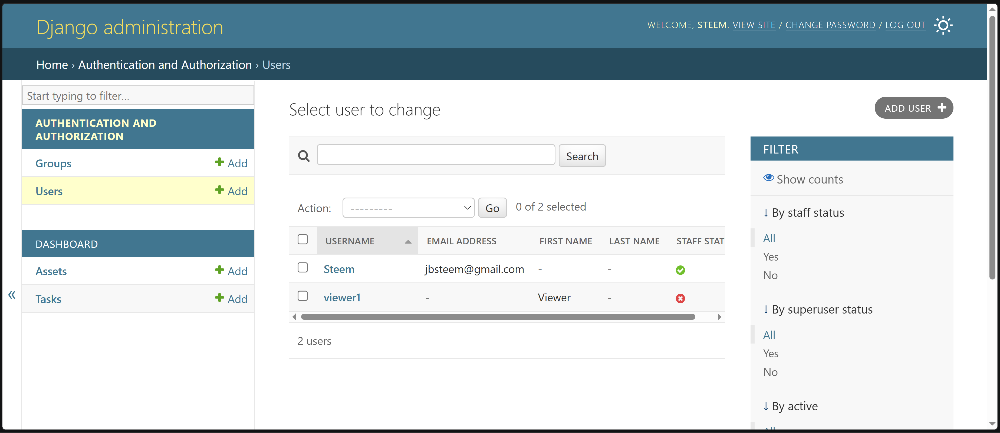

To create a new user, click **Add User**, choose a username and password,
then save. You'll then be able to assign the user to a group.

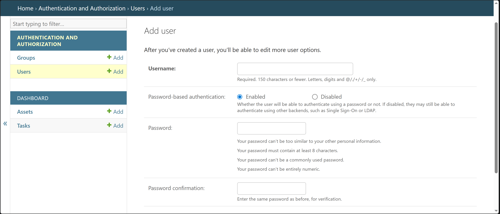

### Managing Groups (Roles)

This app uses two roles, managed under **Authentication and Authorization →
Groups**:

- **admin** — can create and edit Assets and Tasks.
- **viewer** — read-only access to Asset and Task lists/details.

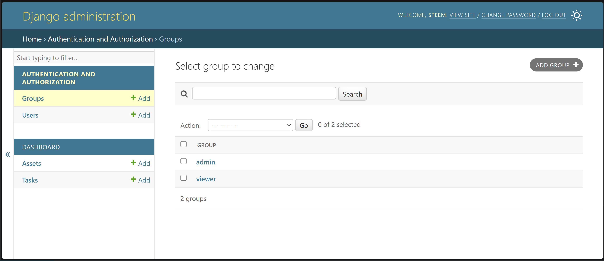

To create a custom group with specific permissions, click **Add Group**, name
it, and choose permissions from the available list.

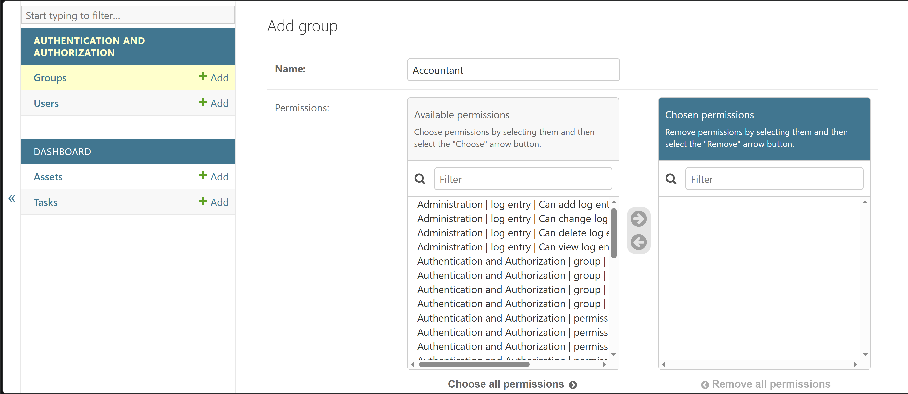

### Changing Your Password

Any logged-in user can change their own password from the admin panel via the
**Change Password** link in the top-right corner.

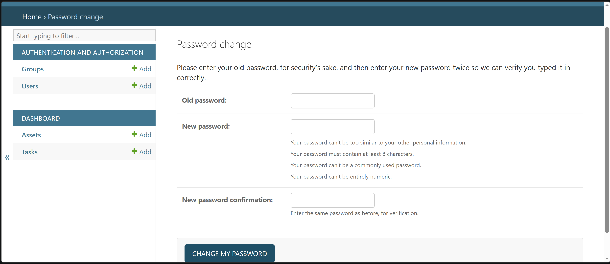

---

## Summary

| Role | Can View | Can Create/Edit |
|------|----------|------------------|
| Anonymous | Asset & Task lists/details | — |
| Viewer | Asset & Task lists/details | — |
| Admin / Superuser | Everything | Assets, Tasks, and (if superuser) Users/Groups via Admin panel |
